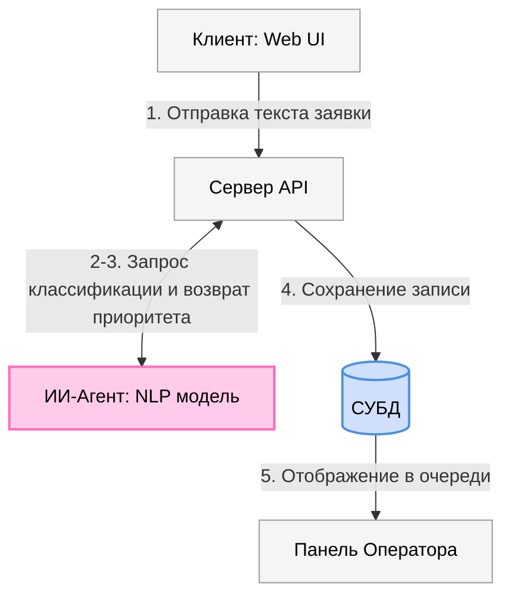

# ТЕХНИЧЕСКОЕ ЗАДАНИЕ

**РАЗРАБОТКА И ВНЕДРЕНИЕ ИНФОРМАЦИОННОЙ СИСТЕМЫ «ПЛАТФОРМА ДЛЯ УПРАВЛЕНИЯ КЛИЕНТСКИМИ ЗАЯВКАМИ (CRM) С ИНТЕЛЛЕКТУАЛЬНОЙ ПРИОРИТИЗАЦИЕЙ»**

---

## Содержание
1. [Общие сведения](#1-общие-сведения)
2. [Назначение системы](#2-назначение-системы)
3. [Описание работы системы](#3-описание-работы-системы)
4. [Требования к системе](#4-требования-к-системе)

---

## 1. Общие сведения

### 1.1 Основание для выполнения работ
Разработка выполняется в рамках учебного курса по направлению подготовки в области искусственного интеллекта (ИИ) и программной инженерии. 

### 1.2 Заказчик и Исполнитель
* **Заказчик:** ВОЛГГТУ
* **Исполнитель:** ИВТ-262, в лице Глезденева А.А., Мишина А.Д. , Мильца Д.С.

### 1.3 Сведения об источниках и порядке финансирования
Финансирование проекта не предусмотрено. Работа выполняется на некоммерческой основе в рамках проектного обучения.

### 1.4 Цель выполнения работ
Целью работы является создание платформы для управления клиентскими заявками (CRM), способствующей повышению скорости и качества обработки обращений за счет внедрения встроенного интеллектуального агента автоматической приоритизации заявок.

### 1.5 Состав работ
Для реализации проекта Исполнителю необходимо выполнить следующие этапы работ:
1. Проектирование архитектуры базы данных и структуры API.
2. Сбор и подготовка текстового набора данных для обучения классификационной модели.
3. Разработка и интеграция интеллектуального модуля (ИИ-агента) приоритизации.
4. Разработка серверной части платформы (Backend).
5. Разработка пользовательского веб-интерфейса (Frontend).
6. Проведение тестирования и отладка разработанного решения.

### 1.6 Сроки выполнения работ
Сроки выполнения этапов определяются календарным планом учебного семестра и утверждаются руководителем проекта.

---

## 2. Назначение системы

Платформа предназначена для оптимизации процессов обработки входящих обращений клиентов в сервисных организациях, службах технической поддержки и отделах продаж. 

Основная задача системы — автоматизация рутинных операций по разбору текстовых обращений и оперативное распределение ресурсов. Интегрированный ИИ-агент проводит анализ текста заявки на этапе её создания и устанавливает один из четырех приоритетов выполнения:
* **Низкий** (Low) — плановые вопросы, общие запросы информации.
* **Средний** (Medium) — стандартные запросы, требующие обработки в течение стандартного рабочего цикла.
* **Высокий** (High) — инциденты, влияющие на работу отдельных пользователей или критичные бизнес-функции.
* **Наивысший** (Critical) — аварийные ситуации, полная остановка сервиса или критический сбой инфраструктуры.

---
## 3. Описание работы системы

### 3.1 Схема взаимодействия компонентов
Диаграмма ниже демонстрирует путь прохождения заявки от момента отправки клиентом до отображения в панели оператора:

## 4. Требования к системе

### 4.1 Функциональные требования

#### 4.1.1 Подсистема управления пользователями и авторизации
* Поддержка трех ролей пользователей: Клиент, Оператор (Агент), Администратор.
* Регистрация и аутентификация по связке E-mail / Пароль с использованием JWT-токенов.
* Ограничение прав доступа к конечным точкам API на основе ролевой модели.

#### 4.1.2 Подсистема работы с заявками
* Создание, просмотр истории и комментирование заявок клиентом.
* Интерактивная панель (Dashboard) для оператора с возможностью фильтрации по приоритету, статусу и дате создания.
* Жизненный цикл заявки должен поддерживать следующие статусы: `Новая` -> `В работе` -> `Ожидает ответа клиента` -> `Решена` -> `Закрыта`.

#### 4.1.3 Интеллектуальный модуль приоритизации (ИИ-агент)
* Автоматический разбор текстовых полей заявки («Тема» + «Описание»).
* Прогнозирование одного из четырех уровней приоритета.
* Возможность логирования ложноположительных срабатываний (когда оператор меняет приоритет вручную) для последующего дообучения модели.

#### 4.1.4 Подсистема уведомлений
* Отправка почтовых уведомлений клиенту при изменении статуса заявки или добавлении нового комментария оператором.
* Визуальные оповещения операторов о поступлении новых заявок с приоритетами «Высокий» и «Наивысший».

