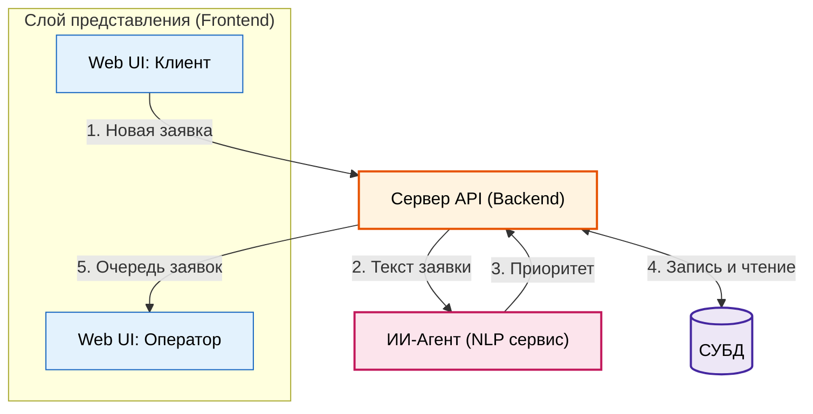

# ТЕХНИЧЕСКОЕ ЗАДАНИЕ

**РАЗРАБОТКА И ВНЕДРЕНИЕ ИНФОРМАЦИОННОЙ СИСТЕМЫ «ПЛАТФОРМА ДЛЯ УПРАВЛЕНИЯ КЛИЕНТСКИМИ ЗАЯВКАМИ (CRM) С ИНТЕЛЛЕКТУАЛЬНОЙ ПРИОРИТИЗАЦИЕЙ»**

---

## Содержание
1. [Общие сведения](#1-общие-сведения)
2. [Назначение системы](#2-назначение-системы)
3. [Описание работы системы](#3-описание-работы-системы)
4. [Требования к системе](#4-требования-к-системе)
5. [Состав и содержание работ по доработке программных средств](#5-состав-и-содержание-работ-по-доработке-программных-средств)
6. [Состав и содержание работ по развертыванию](#6-состав-и-содержание-работ-по-развертыванию)
7. [Порядок контроля и приемки](#7-порядок-контроля-и-приемки)
8. [Гарантийная поддержка](#8-гарантийная-поддержка)
9. [Требования к программной документации](#9-требования-к-программной-документации)
10. [Требования к Исполнителю](#10-требования-к-исполнителю)
---

## 1. Общие сведения

### 1.1 Основание для выполнения работ
Разработка выполняется в рамках учебного курса по направлению подготовки в области искусственного интеллекта (ИИ) и программной инженерии. 

### 1.2 Заказчик и Исполнитель
* **Заказчик:** ВОЛГГТУ
* **Исполнитель:** ИВТ-262, в лице Глезденева А.А., Мишина А.Д. , Мильца Д.С.

### 1.3 Сведения об источниках и порядке финансирования
Финансирование проекта не предусмотрено. Работа выполняется на некоммерческой основе в рамках проектного обучения.

### 1.4 Цель выполнения работ
Целью работы является создание платформы для управления клиентскими заявками (CRM), способствующей повышению скорости и качества обработки обращений за счет внедрения встроенного интеллектуального агента автоматической приоритизации заявок.

### 1.5 Состав работ
Для реализации проекта Исполнителю необходимо выполнить следующие этапы работ:
1. Проектирование архитектуры базы данных и структуры API.
2. Сбор и подготовка текстового набора данных для обучения классификационной модели.
3. Разработка и интеграция интеллектуального модуля (ИИ-агента) приоритизации.
4. Разработка серверной части платформы (Backend).
5. Разработка пользовательского веб-интерфейса (Frontend).
6. Проведение тестирования и отладка разработанного решения.

### 1.6 Сроки выполнения работ
Сроки выполнения этапов определяются календарным планом учебного семестра и утверждаются руководителем проекта.

---

## 2. Назначение системы

Платформа предназначена для оптимизации процессов обработки входящих обращений клиентов в сервисных организациях, службах технической поддержки и отделах продаж. 

Основная задача системы — автоматизация рутинных операций по разбору текстовых обращений и оперативное распределение ресурсов. Интегрированный ИИ-агент проводит анализ текста заявки на этапе её создания и устанавливает один из четырех приоритетов выполнения:
* **Низкий** (Low) — плановые вопросы, общие запросы информации.
* **Средний** (Medium) — стандартные запросы, требующие обработки в течение стандартного рабочего цикла.
* **Высокий** (High) — инциденты, влияющие на работу отдельных пользователей или критичные бизнес-функции.
* **Наивысший** (Critical) — аварийные ситуации, полная остановка сервиса или критический сбой инфраструктуры.

---
## 3. Описание работы системы

### 3.1 Схема взаимодействия компонентов
Диаграмма ниже демонстрирует путь прохождения заявки от момента отправки клиентом до отображения в панели оператора:

1. **Создание заявки:** Клиент вводит тему и описание проблемы в интерфейсе `Web UI: Клиент` и отправляет запрос на `Сервер API`.
2. **Передача на анализ:** `Сервер API` отправляет текст обращения в микросервис `ИИ-Агент`.
3. **Определение приоритета:** `ИИ-Агент` выполняет классификацию текста и возвращает рассчитанный класс приоритета обратно на `Сервер API`.
4. **Сохранение и выборка:** `Сервер API` сохраняет новую заявку в `СУБД`, а при запросе очереди извлекает актуальный список заявок.
5. **Отображение оператору:** `Сервер API` передает подготовленные данные в интерфейс `Web UI: Оператор`, где формируется очередь с цветовой маркировкой по приоритетам.

### 3.2 Концептуальная архитектура
Архитектура системы включает три ключевых слоя:
1. **Слой представления (Frontend):** Адаптивное веб-приложение, предоставляющее интерфейс для клиентов и операторов. Клиенты могут создавать и отслеживать заявки, а операторы — просматривать очередь и обрабатывать обращения.
2. **Прикладной слой (Backend API):** Сервер, обрабатывающий бизнес-логику, авторизацию и взаимодействие с базой данных.
3. **Слой машинного обучения (AI Service):** Микросервис на базе Python, предоставляющий REST API для классификации текста заявки. Сервис выполняет обработку текста и возвращает распределение вероятностей по классам приоритета.

### 3.3 Сценарии использования 

#### 3.3.1 Создание заявки клиентом
* **Действующее лицо:** Клиент.
* **Предусловия:** Клиент авторизован в системе.
* **Основной сценарий:**
  <ol type="1">
    <li>Клиент нажимает кнопку «Создать новую заявку».</li>
    <li>Заполняет поля «Тема» и «Описание проблемы».</li>
    <li>Нажимает кнопку «Отправить».</li>
    <li>Система отправляет текст на классификацию ИИ-агенту.</li>
    <li>Заявке присваивается расчетный приоритет, клиент видит подтверждение создания заявки со статусом «Новая».</li>
  </ol>

#### 3.3.2 Автоматическая классификация ИИ-агентом
* **Действующее лицо:** Интеллектуальный агент (системный процесс).
* **Предусловия:** Получен запрос от Backend API с текстом новой заявки.
* **Основной сценарий:**
  <ol type="1">
    <li>Модуль осуществляет предобработку текста (токенизация, лемматизация, удаление стоп-слов).</li>
    <li>Текст векторизуется и подается на вход классификационной модели.</li>
    <li>Модель вычисляет распределение вероятностей по четырем классам приоритета.</li>
    <li>Модуль возвращает класс с наибольшей вероятностью и значение уверенности модели.</li>
    <li>Если уровень уверенности ниже заданного порога, система помечает приоритет как «Требует подтверждения».</li>
  </ol>

#### 3.3.3 Обработка заявки оператором
* **Действующее лицо:** Оператор поддержки.
* **Предусловия:** Оператор авторизован в консоли обработки заявок.
* **Основной сценарий:**
  <ol type="1">
    <li>Оператор видит список входящих заявок, отсортированных по приоритету (от высшего к низшему).</li>
    <li>Выбирает верхнюю заявку в очереди и берет её в работу (статус меняется на «В работе»).</li>
    <li>При необходимости несоответствия реальной проблемы расчетному значению оператор может вручную переопределить уровень приоритета (изменение логируется системой).</li>
  </ol>

---

## 4. Требования к системе

### 4.1 Функциональные требования

#### 4.1.1 Подсистема управления пользователями и авторизации
* Поддержка трех ролей пользователей: Клиент, Оператор (Агент), Администратор.
* Регистрация и аутентификация по связке E-mail / Пароль с использованием JWT-токенов.
* Ограничение прав доступа к конечным точкам API на основе ролевой модели.

#### 4.1.2 Подсистема работы с заявками
* Создание, просмотр истории и комментирование заявок клиентом.
* Интерактивная панель (Dashboard) для оператора с возможностью фильтрации по приоритету, статусу и дате создания.
* Жизненный цикл заявки должен поддерживать следующие статусы: `Новая` -> `В работе` -> `Ожидает ответа клиента` -> `Решена` -> `Закрыта`.

#### 4.1.3 Интеллектуальный модуль приоритизации (ИИ-агент)
* Автоматический разбор текстовых полей заявки («Тема» + «Описание»).
* Прогнозирование одного из четырех уровней приоритета.
* Возможность логирования ложноположительных срабатываний (когда оператор меняет приоритет вручную) для последующего дообучения модели.

#### 4.1.4 Подсистема уведомлений
* Отправка почтовых уведомлений клиенту при изменении статуса заявки или добавлении нового комментария оператором.
* Визуальные оповещения операторов о поступлении новых заявок с приоритетами «Высокий» и «Наивысший».

### 4.2 Нефункциональные требования

#### 4.2.1 Требования к надежности и производительности
* Время ответа ИИ-модели при классификации одной заявки не должно превышать 1.5 секунд в стандартном режиме работы.
* Базовые операции чтения/записи в БД (без учета вызова ИИ) должны выполняться в пределах 200 мс при нагрузке до 50 одновременных пользователей.
* Система должна корректно обрабатывать сетевые сбои при взаимодействии с ИИ-сервисом: в случае недоступности ML-модуля заявке временно присваивается дефолтный приоритет «Средний», а в лог администратора заносится соответствующая запись.

#### 4.2.2 Требования к точности классификации
* Целевая метрика точности классификации приоритета модели (F1-score) должна быть не ниже 0.75 на тестовом наборе данных перед развертыванием в продуктивную среду.

#### 4.2.3 Требования к безопасности и защите данных
* Все пароли пользователей должны храниться в базе данных в хэшированном виде (с использованием алгоритмовbcrypt или pbkdf2).
* Обмен данными между клиентом и сервером должен осуществляться по защищенному протоколу HTTPS.

---

## 5. Состав и содержание работ по доработке программных средств

### 5.1 Модернизация базового решения CRM
В качестве основы (reference-проекта) принимается стандартный прототип Service Desk с базовыми CRUD-операциями и ручным назначением приоритетов. 

В рамках модернизации выполняются следующие доработки:
* Расширение модели данных заявки полями: расчетный приоритет (AI Priority), уровень уверенности (Confidence Score) и признак ручной смены приоритета.
* Доработка Backend для асинхронного вызова сервиса приоритизации при создании заявки.
* Реализация резервного сценария (Fallback): автоматическое присвоение статуса «Средний» при недоступности ИИ-сервиса.

### 5.2 Разработка микросервиса интеллектуальной приоритизации
Создание отдельного сервиса (Python / FastAPI) для автоматической классификации входящих обращений:
* Реализация пайплайна предобработки текста: очистка, токенизация, удаление стоп-слов, лемматизация.
* Интеграция обученной модели машинного обучения для классификации заявок по 4 уровням приоритета.
* Передача результатов оценки (класс приоритета и уверенность модели) через REST API.

### 5.3 Разработка подсистемы сбора обратной связи (Feedback Loop)
* Логирование случаев ручной корректировки приоритета оператором для фиксации ошибок модели.
* Реализация выгрузки накопленных скорректированных данных для последующего дообучения классификатора.

### 5.4 Доработка пользовательского интерфейса
* **Рабочее место оператора:** внедрение списка заявок с цветовой маркировкой приоритетов, сортировкой по уровню критичности и отображением флага низкой уверенности ИИ.
* **Карточка заявки:** добавление интерфейса быстрой смены приоритета оператором.

### 5.5 Разработка интеграционного API
Реализация REST API для взаимодействия Backend-сервера и микросервиса приоритизации:
* `POST /api/v1/predict` — передача текста заявки, получение приоритета и уверенности.
* `POST /api/v1/feedback` — отправка данных о ручном изменении приоритета оператором.
* `GET /api/v1/health` — мониторинг доступности ИИ-сервиса и версии модели.

---

## 6. Состав и содержание работ по развертыванию

### 6.1 Требования к среде развертывания
Развертывание программного комплекса реализуется по приоритетному веб-варианту на базе технологии контейнеризации Docker. Решение должно обеспечивать гарантированный и идентичный запуск как на компьютере студента (среда разработки), так и на компьютере преподавателя (среда проверки).

Минимальные системные требования к рабочей станции:
* Установленное ПО: Git, Docker Engine (версии 24.0 и выше), Docker Compose (v2.x).
* Операционная система: Windows 10/11 (с WSL2), macOS или Linux.
* Аппаратные ресурсы: процессор не менее 4 ядер, оперативная память от 8 Гб, свободное дисковое пространство от 10 Гб.
* Открытые локальные порты: 80/3000 (веб-интерфейс), 8000 (Backend API), 8001 (ИИ-сервис), 5432 (СУБД).

### 6.2 Архитектура контейнеризации (Docker Compose)
Система собирается и запускается в изолированном сетевом контуре через конфигурационный файл `docker-compose.yml`, включающий следующие сервисы:
* **db:** сервер базы данных (PostgreSQL) с подключенным volume для сохранения данных.
* **ai-service:** микросервис инференса ИИ-агента (Python/FastAPI) с предварительно загруженными весами обученной модели.
* **backend:** сервер прикладной логики (REST API), выполняющий оркестрацию запросов и связь с БД.
* **frontend:** веб-приложение интерфейсов клиента и оператора (Nginx / SPA).

### 6.3 Порядок и сценарий запуска ПО
Процесс ввода системы в эксплуатацию не требует установки сторонних библиотек и выполняется по стандартному сценарию:
1. **Клонирование проекта:** получение исходного кода из Git-репозитория.
2. **Инициализация конфигурации:** копирование типового файла переменных окружения `cp .env.example .env` (параметры по умолчанию оптимизированы для локального запуска).
3. **Сборка и старт контейнеров:** выполнение команды `docker compose up --build -d`.
4. **Автоматическая инициализация:** контейнеры в порядке зависимостей (depends_on) применяют миграции структуры БД и выполняют первичное наполнение демонстрационными данными (учетные записи ролей, стартовые заявки).

### 6.4 Проверка работоспособности
Успешность развертывания проверяется доступностью основных компонентов через браузер:
* Пользовательский веб-интерфейс CRM: `http://localhost:3000` (или `http://localhost`).
* Интерактивная документация API (Swagger UI): `http://localhost:8000/docs`.
* Проверка готовности ИИ-агента (Healthcheck): `http://localhost:8001/api/v1/health`.
* Остановка и очистка контейнеров выполняется командой: `docker compose down`.

---

## 7. Порядок контроля и приемки

### 7.1 Разграничение штатного и внештатного поведения
Для контроля качества определены критерии нормальной работы и сбоев:
* **Штатное поведение:**
  * Успешная авторизация с разделением прав по ролям (Клиент / Оператор / Администратор).
  * Классификация текста заявки ИИ-агентом за время ≤ 1.5 с с присвоением одного из 4 приоритетов.
  * Корректный переход заявки по жизненному циклу и сохранение в СУБД.
  * Логирование ручной корректировки приоритета оператором для дообучения.
* **Внештатное поведение:**
  * Сбои или тайм-аут сервиса ИИ (> 1.5 с) — система обязана перейти в аварийный режим (Fallback) с назначением приоритета «Средний».
  * Падение любого Docker-контейнера или потеря связи с СУБД (HTTP 500).
  * Необработанные исключения при вводе невалидных или пустых текстов в форму заявки.

### 7.2 Действия по выявлению нештатного поведения
Для проверки надежности выполняются следующие мероприятия:
1. **Автотесты (Unit / Integration):** проверка позитивных сценариев работы API и негативных кейсов (невалидные токены, попытки инъекций).
2. **Тестирование граничных условий ИИ:** подача зашумленного текста для проверки порога уверенности (Confidence Score < 0.60) и принудительное отключение контейнера `ai-service` для проверки Fallback-логики.
3. **Анализ журналов:** мониторинг ошибок в реальном времени через `docker compose logs`.

---

## 8. Гарантийная поддержка

### 8.1 Условия и регламент поддержки
Исполнитель осуществляет гарантийную поддержку разработанной платформы в течение периода опытной эксплуатации и защиты проекта (до окончания учебного семестра):
* Прием обращений о сбоях и дефектах осуществляется через систему контроля версий (Git Issues) или электронную почту Исполнителя.
* Исправление ошибок в программном коде и корректировка конфигураций развертывания выполняются силами команды разработки без привлечения внешних ресурсов.

### 8.2 Классификация инцидентов и сроки устранения
Время реакции и устранения инцидентов дифференцируется по уровню критичности:

| Уровень инцидента | Описание ситуации | Максимальный срок устранения |
| :--- | :--- | :--- |
| **1-й (Критичный)** | Полная неработоспособность CRM, падение Docker-контейнеров, отказ СУБД, невозможность создания и сохранения заявок. | До 24 часов |
| **2-й (Высокий)** | Сбой сервиса ИИ (при сохранении работы механизма Fallback), недоступность фильтрации или обновления статусов тикетов. | До 2 рабочих дней |
| **3-й (Стандартный)** | Ошибки верстки, неточности отображения в UI, мелкие недочеты валидации, не блокирующие основной бизнес-процесс. | До 4 рабочих дней |

---

## 9. Требования к программной документации

### 9.1 Состав документации
По итогам выполнения работ Исполнитель передает Заказчику (ВолгГТУ) комплект документации:
* **Техническая документация:**
  * Настоящее Техническое задание.
  * Пояснительная записка к проекту (описание архитектуры, схемы БД и конвейера NLP).
* **Эксплуатационная документация:**
  * Руководство по развертыванию и администрированию системы (файл `README.md` в репозитории с инструкциями по Docker Compose).
  * Руководство пользователя (описание рабочих мест Клиента и Оператора).
