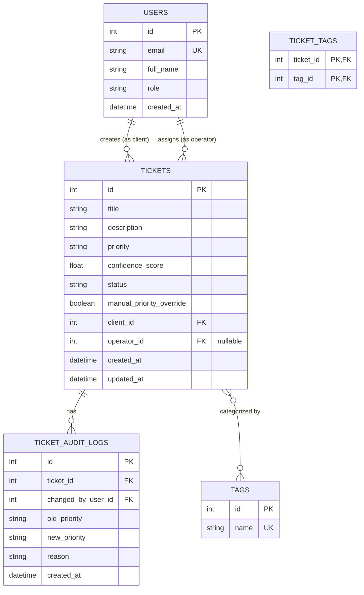

```mermaid
erDiagram
    USERS ||--o{ TICKETS : "creates (as client)"
    USERS ||--o{ TICKETS : "assigns (as operator)"
    TICKETS ||--o{ TICKET_AUDIT_LOGS : "has"
    TICKETS }o--o{ TAGS : "categorized by"

    USERS {
        int id PK
        string email UK
        string full_name
        string role
        datetime created_at
    }

    TICKETS {
        int id PK
        string title
        string description
        string priority
        float confidence_score
        string status
        boolean manual_priority_override
        int client_id FK
        int operator_id FK "nullable"
        datetime created_at
        datetime updated_at
    }

    TAGS {
        int id PK
        string name UK
    }

    TICKET_TAGS {
        int ticket_id PK,FK
        int tag_id PK,FK
    }

    TICKET_AUDIT_LOGS {
        int id PK
        int ticket_id FK
        int changed_by_user_id FK
        string old_priority
        string new_priority
        string reason
        datetime created_at
    }
```
